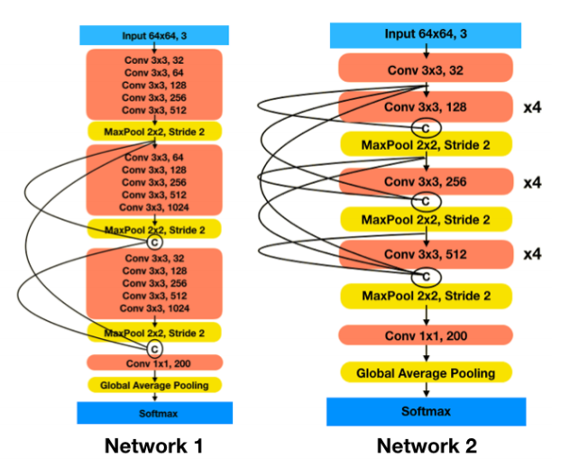

# TinyDenseNet

A Python3 and tensorflow=1.12.0 implementation of TinyDenseNet and provide train method and trained model.

According to the paper: [DenseNet Models for Tiny ImageNet Classification](https://arxiv.org/abs/1904.10429).

## Requirements
- python=3.6
- opencv>=3
- Tensorflow-gpu=1.12.0

## DataSet

- [Tiny ImageNet](http://tiny-imagenet.herokuapp.com/)

## Network Architectures

## Reimplementation Results

| Network | Author | Our |
|--------|--------|--------|
|Netwrok2|62.73    |63.12   |

